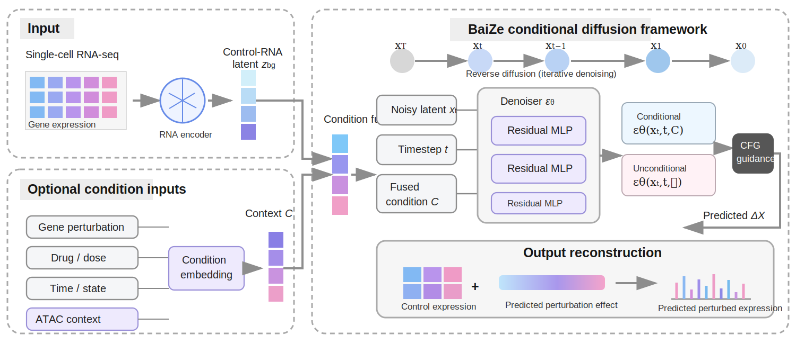

# BaiZe

## A multi-view conditional diffusion framework for simulating cellular responses across perturbation contexts

<p align="center">
  
</p>

BaiZe models a cellular response as a **conditional state transition**. Given an unperturbed single-cell RNA profile and a perturbation context, the framework predicts the perturbation-induced expression shift and reconstructs the post-intervention state:

\[
\hat{x}_{\mathrm{pert}} = x_{\mathrm{ctrl}} + \widehat{\Delta x}.
\]

The control transcriptome is encoded as a cellular-background representation, while genetic interventions, drug structure and dose, temporal or state information, species context, and optional chromatin accessibility are mapped to a unified condition representation. A conditional diffusion decoder then iteratively generates the expression-change vector \(\widehat{\Delta x}\). This design provides a shared modeling interface for heterogeneous perturbation settings while preserving the biological context of the starting cell state.

## Framework scope

| Modeling setting | Inputs | Predicted output | Main analysis supported |
|---|---|---|---|
| Genetic perturbation | Control RNA and one or more perturbed genes | Single-cell expression change and perturbed RNA state | Single-gene, combinatorial and higher-order perturbation prediction |
| Chemical perturbation | Control RNA, molecular structure, dose and cellular context | Drug-induced expression change | Unseen-drug, held-out-cell-context and dose-response analysis |
| ATAC-guided prediction | Control RNA, perturbation condition and optional ATAC context | Chromatin-informed RNA response | RNA-only versus RNA+ATAC comparison, promoter masking and peak-level attribution |
| Temporal state transition | Earlier control state, target time or state and optional matched ATAC | Future RNA state | Time-course prediction, lineage progression and donor-held-out evaluation |
| Cross-species transfer | Source-species perturbation data, target-species control state and ortholog-aligned features | Target-species perturbation response | Human-to-mouse zero-shot transfer and few-shot target-species adaptation |
| Downstream interpretation | Predicted expression matrices and derived response signatures | Genes, pathways, regulatory regions and projected phenotypes | Functional enrichment, morphology projection and evidence-linked interpretation |

For SNP-informed applications, BaiZe uses a variant-associated candidate gene to define a perturbation task and predicts the downstream transcriptional consequences of altered gene activity. This analysis does not constitute direct allele-specific SNP-effect prediction.

## Model overview

BaiZe contains four main components:

1. **Cellular-background encoder**: maps the control RNA profile to a latent representation of the pre-intervention cell state.
2. **Condition encoder**: represents gene perturbations, multi-gene combinations, drug structure, dose, time, state, species context and optional ATAC features in a shared condition space.
3. **Conditional diffusion decoder**: predicts the perturbation-induced expression shift through iterative denoising with classifier-free guidance.
4. **Output reconstruction**: adds the predicted expression shift to the control state to obtain the simulated post-intervention transcriptome.

The default target is the expression-change space (`--target_mode delta`), which separates perturbation effects from the high baseline similarity shared by control and perturbed transcriptomes.

## Repository structure

| Path | Description |
|---|---|
| `train_diffusion.py` | Unified training entry point for the conditional diffusion model |
| `evaluate_diffusion.py` | Single-cell and perturbation-level evaluation |
| `predict_diffusion.py` | Perturbation inference, multi-gene composition and interpolation |
| `visualize_diffusion.py` | Response visualization and combinatorial perturbation analysis |
| `models/scerso_diffusion.py` | BaiZe model definition |
| `models/diffusion_core.py` | Diffusion process, sampling and denoising utilities |
| `utils/data_processor.py` | AnnData loading, split construction, control pools and condition fields |
| `scripts/` | Drug, ATAC, temporal, cross-species and perturbation-analysis workflows |
| `scripts_morphology/` | Export and conversion utilities for transcriptome-guided morphology projection |
| `multiperturb_seq/` | MultiPerturb-seq RNA+ATAC processing and analysis |
| `norman_combo_gears_style/` | Combinatorial perturbation splits and residual modeling utilities |

## Installation

BaiZe was developed with Python 3.10 and PyTorch. The core workflow requires PyTorch, Scanpy/AnnData, NumPy, SciPy, pandas, scikit-learn, matplotlib and tqdm. RDKit is required when drug structures are encoded from SMILES strings.

```bash
conda create -n baize python=3.10 -y
conda activate baize
pip install torch scanpy anndata numpy scipy pandas scikit-learn matplotlib seaborn tqdm rdkit
```

## Input organization

The main training input is an AnnData (`.h5ad`) object. Gene order must remain consistent across control and perturbed matrices. The required observation fields depend on the experiment, but the framework uses a common organization:

| Field | Purpose |
|---|---|
| `perturbation` | Gene, multi-gene or drug perturbation label |
| `is_control` | Control-state indicator |
| `split` | Optional predefined train, validation and test assignment |
| `cell_context` | Cell line, cell type, state, donor or other biological background |
| `smiles` | Drug molecular structure for structure-conditioned prediction |
| `dose` | Drug concentration or continuous treatment intensity |
| `atac_feat` | Optional aligned chromatin-accessibility representation |

Control labels such as `control`, `ctrl`, `DMSO` and `vehicle` should be harmonized before model training. Cross-dataset analyses additionally require a consistent gene order and, where applicable, one-to-one ortholog alignment.

## Unified training

The same training entry point is used across genetic, chemical, temporal and ATAC-guided experiments. Task-specific behavior is selected through the condition fields and a small number of command-line arguments.

```bash
python train_diffusion.py \
  --data_path /path/to/processed_data.h5ad \
  --save_dir ./outputs/baize_run \
  --task_mode <single_gene|translation|drug> \
  --split_strategy <perturbation|custom> \
  --split_col split \
  --target_mode delta \
  --preset vnext \
  --amp \
  [--perturb_parse_mode multi_gene_parse] \
  [--atac_key atac_feat] \
  [--smiles_col smiles --dose_col dose --context_col cell_context]
```

The optional arguments activate multi-gene parsing, ATAC conditioning or drug structure and dose conditioning without changing the core training program. For predefined temporal, donor-held-out or cell-context-held-out experiments, the desired partitions are stored in `obs['split']` and trained with `--split_strategy custom`.

## Unified evaluation and prediction

```bash
python evaluate_diffusion.py \
  --data_path /path/to/processed_data.h5ad \
  --model_path ./outputs/baize_run/best_model.pth \
  --task_mode <single_gene|translation> \
  --split_strategy <perturbation|custom> \
  --split_col split \
  --output_json ./outputs/baize_run/evaluation.json \
  [--perturb_parse_mode multi_gene_parse] \
  [--atac_key atac_feat]
```

For direct perturbation simulation, multi-gene composition and latent interpolation, use `predict_diffusion.py` with the trained checkpoint. Drug-specific evaluation is implemented in `scripts/evaluate_drug_response.py`, and cross-species evaluation is implemented in `scripts/evaluate_cross_species_mouse.py` and `scripts/evaluate_cross_species_context_preds.py`.

## Evaluation

BaiZe is evaluated primarily in the expression-change space. Reported measures include whole-transcriptome Pearson correlation, expression-change Pearson correlation, Top-k expression-change Pearson correlation, Top-k mean squared error, recovery of strongly responsive genes and the fraction of top response genes predicted in the opposite direction. Metrics can be computed at both the single-cell level and after aggregation by perturbation, dose, cell context, time point or species-specific state.

## Data sources

| Dataset or resource | BaiZe analysis | Accession or source |
|---|---|---|
| Sci-Plex | Chemical structure- and dose-conditioned drug-response prediction | [GEO: GSE139944](https://www.ncbi.nlm.nih.gov/geo/query/acc.cgi?acc=GSE139944) |
| MultiPerturb-seq RNA+ATAC | ATAC-guided perturbation prediction, promoter peak masking and peak-level attribution | [GEO: GSE277747](https://www.ncbi.nlm.nih.gov/geo/query/acc.cgi?acc=GSE277747) |
| Human CD8 T-cell perturbation data | Source-species training for cross-species perturbation transfer | [GEO: GSE218988](https://www.ncbi.nlm.nih.gov/geo/query/acc.cgi?acc=GSE218988) |
| Mouse tumour-infiltrating T-cell Perturb-seq and chromatin accessibility | Target-species zero-shot and few-shot evaluation | [GEO: GSE203593](https://www.ncbi.nlm.nih.gov/geo/query/acc.cgi?acc=GSE203593) |
| HSPC time-course multiome | Temporal RNA-state prediction with optional matched ATAC context | [GEO: GSE305370](https://www.ncbi.nlm.nih.gov/geo/query/acc.cgi?acc=GSE305370) |
| Replogle K562 CRISPRi Perturb-seq | SNP-informed HIF1A case study and related perturbation-response analyses | [Processed Perturb-seq release on Figshare](https://plus.figshare.com/articles/dataset/_Mapping_information-rich_genotype-phenotype_landscapes_with_genome-scale_Perturb-seq_Replogle_et_al_2022_processed_Perturb-seq_datasets/20029387); [Genome-Wide Perturb-Seq portal](https://gwps.wi.mit.edu/) |
| Ensembl BioMart | Human-mouse one-to-one ortholog mapping and gene annotation | [Ensembl BioMart](https://www.ensembl.org/biomart/martview) |
| UCSC Genome Browser | Reference genome coordinates and genomic-region annotation | [UCSC Genome Browser](https://genome.ucsc.edu/) |

## Cross-species workflow

The recommended cross-species workflow aligns human and mouse genes in a shared one-to-one ortholog space, estimates source-species perturbation effects, calibrates them with the target-species control background and evaluates the resulting response across target-species cell states.

```text
Human perturbation data
        ↓
One-to-one ortholog alignment
        ↓
Target-species control-state calibration
        ↓
Mouse perturbation-response prediction
        ↓
Zero-shot evaluation or few-shot target-species adaptation
```

The main scripts are `scripts/cross_species_diagnose_data.py`, `scripts/cross_species_build_pseudobulk.py`, `scripts/cross_species_train_residual.py`, `scripts/cross_species_infer_residual.py`, `scripts/evaluate_cross_species_mouse.py` and `scripts/evaluate_cross_species_context_preds.py`.

## BaiZe-Agent

<p align="center">
  <a href="https://enjoyed-sitemap-tables-underwear.trycloudflare.com/"><strong>Open the BaiZe-Agent interactive demo</strong></a>
  &nbsp;·&nbsp;
  <a href="https://github.com/simonzqw/BaiZe"><strong>View the BaiZe repository</strong></a>
</p>

<p align="center">
  
</p>

BaiZe-Agent is a natural-language interface for exploring results produced by the BaiZe single-cell perturbation modelling framework. It does not retrain BaiZe or generate new cellular states during a query. Instead, it retrieves structured evidence from indexed CSV, JSON and result files, matches related figures through a figure registry, and returns evidence-grounded explanations with traceable source records.

### Current capabilities

| Capability | Supported exploration |
|---|---|
| Cross-species perturbation responses | Human-to-mouse prediction metrics, response genes, state-specific patterns and related figures |
| Combinatorial perturbations | Single-, dual- and triple-gene response analysis, including higher-order combinations |
| Drug and dose responses | Unseen-drug performance, dose-dependent responses and cell-context comparisons |
| Temporal prediction | RNA-only and RNA+ATAC predictions across time points, states and held-out donors |
| ATAC-informed interpretation | ATAC-corrected genes, promoter masking results and peak-level attribution |
| Functional interpretation | Gene-response, pathway-enrichment, differential-expression and metric queries |
| Evidence and figure retrieval | Indexed result-file lookup and dynamic display of registered figures |
| Report generation | Saving answers, evidence records and related figures as PDF reports |

### Example questions

- How did BaiZe perform on unseen drugs?
- Show the PDCD1 cross-species volcano plot.
- Which genes were corrected by ATAC for BAZ1B?
- How did correct-time ATAC improve prediction at Day7?
- Which genes responded most strongly to ATF6+EIF2AK3+ERN1?

### Evidence handling

Numerical values are read from indexed result files whenever available, and related images are retrieved through the figure registry. The interface distinguishes retrieved evidence from narrative interpretation and retains the source paths used to construct each response. Prediction agreement, differential expression, enrichment and attribution analyses provide model-supported evidence, but do not by themselves establish causality, pathway activation or direct molecular regulation.

The interface provides a new-exploration view, recent session history, saved results and an integrated help page. The public demonstration is available at [BaiZe-Agent Explorer](https://enjoyed-sitemap-tables-underwear.trycloudflare.com/).

## Reproducibility

Model checkpoints, large processed matrices and generated result files are not stored in the repository. Experiments are reproduced from the public datasets listed above, preprocessing scripts, saved configuration files and the command-line interfaces provided by the training and evaluation programs.
